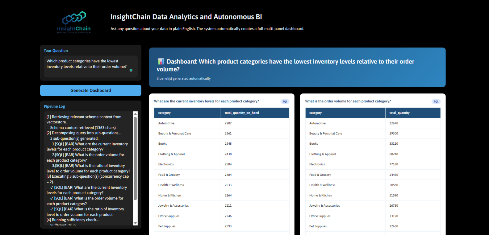
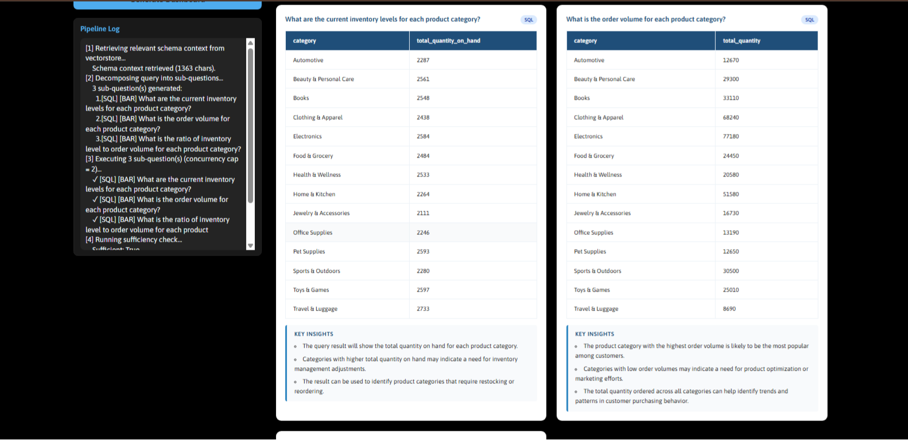
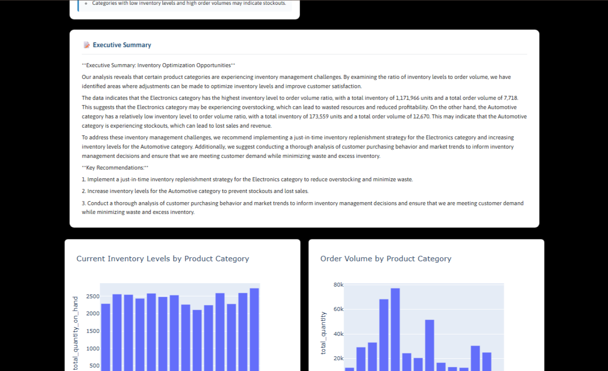
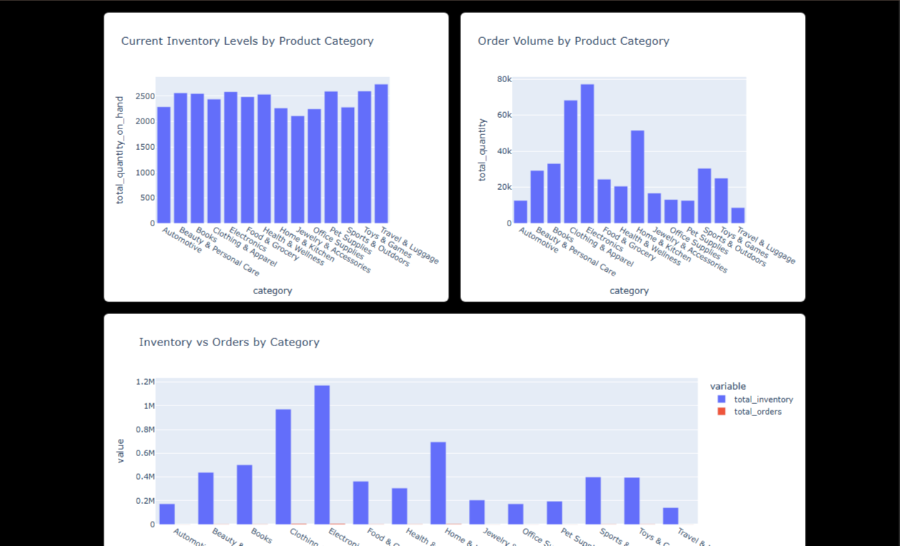

<div align="center">
    
</div>

<p>


</p>

> Ask questions about your data in plain English. Get a full multi-panel dashboard back — charts, tables, insights, and an executive summary — generated automatically.

**InsightChain** is a natural-language BI system that takes a high-level business question, decomposes it into specific sub-questions, answers each one from a SQLite database (or a document corpus, for qualitative questions), and assembles the results into a rendered dashboard — charts, tables, per-panel insights, and an executive narrative — with no manual query writing or chart configuration required.

It's built as a small multi-agent pipeline: a planner, parallel SQL/semantic executors, a self-grading sufficiency check, and an insight synthesis step, all running on top of Groq-hosted Llama models, ChromaDB, and Plotly, served through a Gradio UI.

***My Article containing the detailed account of the creation of this project, what challenges I faced, and my research to solve each problem, along with future architectural considerations using MCP servers and agent skills: [WIP]***


---

## Table of Contents

- [Overview](#overview)
- [Screenshots](#screenshots)
- [Key Features](#key-features)
- [How It Works?](#how-it-works)
- [Tech Stack](#tech-stack)
- [Prerequisites](#prerequisites)
- [Installation](#installation)
- [Configuration](#configuration)
- [Adding Your Data](#adding-your-data)
- [Running the App](#running-the-app)
- [Usage](#usage)
- [Architecture Deep Dive](#architecture-deep-dive)
- [Security Design](#security-design)
- [Limitations Placed on LLM](#limitations-on-llm) 
- [Configuration Reference](#configuration-reference)
- [Limitations](#limitations)
- [Roadmap](#roadmap)
- [Contributing](#contributing)

---

## Overview

**InsightChain** is a fully local, LLM-powered business intelligence system. Drop your CSV files into a folder, point the system at them, and ask questions in plain English. The pipeline automatically:

1. Decomposes your question into specific, answerable sub-questions
2. Routes each sub-question to either a SQL engine or a semantic reasoning engine
3. Generates, validates, and executes SQL queries — with automatic repair on failure
5. Produces Plotly charts, data tables, and bullet-point insights for each panel
6. Synthesises all results into a written executive summary
7. Verifies the results actually answer what you asked, and follows up if not

The whole pipeline runs in a Gradio web UI. No BI tool expertise required. No SQL knowledge required.

## Screenshots
</br>
<div style="align-items: center; display: flex; flex-direction: column">
    </br></br>
    </br></br>
    </br></br>
    </br></br>
</div>

---

## Key Features
- **Automatic query decomposition and routing** — </br> Complex and context heavy questions are split into focused sub-questions, the LLM identifies whether a question (or subquestion) needs to be answered from tabular data (quantitative questions) or documents (qualitative questions), and based on this the LLM routes them through appropriate chains.

- **Two separte retrieval-augmented tracks.** — </br>  Quantitative sub-questions go through a SQL-generation chain; qualitative ones are answered from sampled data rows<sup>*</sup> and indexed DOCX content via the same vectorstore.

- **Schema Agnostic & Schema-aware, not schema-dumping.** — </br>  Instead of stuffing the full database schema into every prompt, a RAG layer retrieves only the tables and columns relevant to the current question — this is what lets the architecture scale toward large schemas (tens of tables) without blowing the token budget.

- **Individual insight generation.** — </br> For each data table which is generated as a part of dashboard, 2-3 insightful and actionable comments are also included.

- **Persistant Vectorstore and db to save execution time** — </br>  Instead of creating a new vectorstore each time the program runs, ChromaDB creates a persistant vectorstore which is setup as the files are loaded for the first time. [See more in: [Adding Your Data](#adding-your-data)]

- **A Unified Vectorstore** — </br>  A single ChromaDB collection indexes three fundamentally different types of content, unified under a metadata tagging system.

- **Guardrails at the execution boundary, not the prompt.** — </br>  LLM-generated SQL and chart code never run unchecked: every query is validated (`SELECT`-only, single-statement, keyword-blocklisted) before it touches SQLite, and every chart snippet executes inside a sandboxed `exec()` with a restricted builtins set.

- **Iterative Chain of Thought (I-CoT) — </br>  Self-correcting, within limits.** The pipeline checks its own output for sufficiency and can ask itself one or two follow-up questions before writing the final summary/SQL — a small, capped agentic loop rather than a single-shot prompt.

- **Full pipeline logging** — </br>  Every step logged in the UI for debugging and transparency.

---

## How It Works?


---
## Tech Stack

| Layer | Technology |
|---|---|
| **LLM Inference** | [Groq API](https://groq.com) — `llama-3.3-70b-versatile` + `llama-3.1-8b-instant` |
| **LLM Orchestration** | [LangChain](https://python.langchain.com) |
| **Embeddings** | `sentence-transformers/all-MiniLM-L6-v2` via HuggingFace |
| **Vector Store** | [ChromaDB](https://www.trychroma.com) |
| **Database** | SQLite (auto-populated from your CSVs) |
| **Data Processing** | Pandas |
| **SQL Validation** | sqlparse + custom regex guardrails |
| **Visualisation** | Plotly Express + Plotly Graph Objects |
| **UI** | [Gradio](https://www.gradio.app) |
| **Output Parsing** | Pydantic v2 + LangChain `JsonOutputParser` |

---

## 

```
InsightChain-auto-bi-dashboard/
│
├── app.py                  # Entry point — initialises and launches the Gradio app
├── config.py               # All imports, paths, constants, and model names
│
├── startup.py              # DB initialisation + vectorstore build/load on launch
├── orchestrator.py         # Top-level query handler — calls pipeline stages in order
├── pipeline.py             # Individual pipeline stage functions (decompose, execute, etc.)
├── executor.py             # Runs one sub-question end-to-end (SQL or Semantic path)
│
├── chains.py               # LangChain chain builders for each LLM role
├── models.py               # Pydantic output models for structured LLM responses
├── singletons.py           # Global chain instances — built once per session
│
├── database.py             # CSV → SQLite ingestion, schema introspection, query execution
├── vectorstore.py          # ChromaDB index: schema descriptions, column metadata, DOCX chunks
├── guardrails.py           # SQL validation, sandboxed chart executor
│
├── render_dashboard.py     # HTML renderer for tables, insights, and narrative
├── ui.py                   # Gradio Blocks layout and event wiring
│
├── data/                   # ← DROP YOUR CSV FILES HERE
├── documents/              # ← DROP YOUR DOCX FILES HERE (optional)
├── db/                     # Auto-created — SQLite database lives here
└── chroma_index/           # Auto-created — ChromaDB persisted index lives here
```

---

### File Responsibilities at a Glance

| File | What it owns                                                                                                            |
|---|-------------------------------------------------------------------------------------------------------------------------|
| `config.py` | Single source of truth for all imports, paths, model names, and tunable constants                                       |
| `chains.py` | Every LLM prompt and chain — decomposer, SQL generator, repair chain, semantic, sufficiency, reducer, individual insights |
| `models.py` | Pydantic schemas that enforce structured output from every LLM call                                                     |
| `guardrails.py` | All safety layers: SQL validation, sandboxed `exec()`                                                                   |
| `database.py` | Everything that touches SQLite — loading CSVs, PRAGMA introspection, query execution                                    |
| `vectorstore.py` | Building and querying the ChromaDB index — schema descriptions, column entries, DOCX chunks                             |
| `executor.py` | The per-sub-question execution loop — invokes the right chain, handles repair, runs chart code                          |
| `pipeline.py` | Orchestrates stages: schema retrieval, decomposition, parallel execution, sufficiency, narrative                        |
| `singletons.py` | Initialises all chain objects once and holds them as module-level global variables                                      |

---

## Prerequisites

- Python **3.10 or higher**
- A **Groq API key** (free tier available at [console.groq.com](https://console.groq.com))
- A **HuggingFace token** (free at [huggingface.co](https://huggingface.co/settings/tokens)) — used for the embedding model download
- Git

---

## Installation

### 1. Clone the repository

```bash
git clone https://github.com/aman21900/InsightChain.git
cd InsightChain-auto-bi-dashboard
```

### 2. Create a virtual environment

```bash
python -m venv venv

# On macOS / Linux
source venv/bin/activate

# On Windows
venv\Scripts\activate
```

### 3. Install dependencies

```bash
pip install -r requirements.txt
```

<details>
<summary>Don't have a requirements.txt yet? Click to expand the full dependency list.</summary>

```txt
langchain
langchain-core
langchain-groq
langchain-huggingface
langchain-chroma
chromadb
sentence-transformers
gradio
pandas
plotly
sqlparse
pydantic
python-dotenv
python-docx
```

</details>

---

## Configuration

### 1. Set up your environment variables

Create a `.env` file in the project root:

```bash
touch .env
```

Add your API keys:

```env
GROQ_API_KEY=your_groq_api_key_here
HF_TOKEN=your_huggingface_token_here
```

### 2. Verify your `.gitignore`

Make sure these are ignored:

```gitignore
.env
db/
chroma_index/
notebooks/
__pycache__/
*.pyc
venv/
.venv/
```

---

## Adding Your Data

### CSV files (structured data → SQL queries)

Drop any number of `.csv` files into the `data/` folder. Each file becomes a SQLite table. The table name is derived from the filename — spaces and hyphens are converted to underscores, everything lowercased.

```
data/
├── purchase_orders.csv     → table: purchase_orders
├── supplier-performance.csv → table: supplier_performance
└── Monthly Inventory.csv   → table: monthly_inventory
```

**Tips:**
- Column names with spaces work fine — they're quoted in generated SQL
- The first row must be the header row
- Mixed numeric/string columns are handled automatically by Pandas
- There is no limit on the number of files or rows, but very large tables (> 500k rows) will slow down the vectorstore index build

> Note: 
> 1. Please make sure to **not use files containing PII values**, 
> as some sample columns are given to LLM during schema context generation — through Groq API.
> Please refer: [Security Limitations](#security-limitations).
> 2. It is generally not recommended to use PII data to even create local vectorstores.
> As important data could be reverse engineered from the vectorstore.
> 3. The sole purpose of passing sample rows is to just improve the context quality.
> It can be removed entirely, and the LLM models can work with interpreted meaning 
> of the column and table names to establish schema context.

### DOCX files (unstructured documents → semantic queries)

Drop any `.docx` files into the `documents/` folder. These are chunked (~500 words, 50-word overlap) and indexed alongside the schema, enabling the system to answer qualitative questions grounded in your documents — policies, SOPs, supplier agreements, etc.

```
documents/
├── supplier_contracts.docx
└── procurement_policy.docx
```

---

## Running the App

```bash
python app.py
```

On first run, the system will:

1. Load all CSVs from `data/` into SQLite
2. Build the ChromaDB vectorstore index (LLM-generated descriptions for every table and column — this takes **2–5 minutes** depending on how many tables you have)
3. Launch the Gradio UI at `http://localhost:7860`

On subsequent runs, the existing index is loaded from disk and the UI launches immediately.

> **To force a full index rebuild** (e.g. after adding new CSV files), call `_vs.build_index()` manually from a Python shell, or delete the `chroma_index/` directory and restart.

---

## Usage

Open `http://localhost:7860` in your browser.

Type any business question in the text box and click **Generate Dashboard**.

**Example questions (Based on sample data used) :**
```
How is our supply chain performing?

Which suppliers have the highest and lowest on-time delivery rates?

Show me monthly purchase order trends for the last year.

What is the distribution of order values by product category?

Which products have the highest inventory turnover?

Compare average lead times across our top 10 suppliers.

Are there any concerning patterns in our procurement costs?
```

The pipeline log on the left shows every step as it executes. The dashboard on the right renders charts, data tables, bullet-point insights, and a written executive summary.

---

## Architecture Deep Dive

### Query Decomposition

The decomposer LLM (`llama-3.3-70b-versatile`) takes the user's question and a schema context retrieved from the vectorstore, and outputs a list of specific sub-questions. Each sub-question includes:

- `question` — the specific, answerable question
- `chart_type` — the most appropriate visualisation (`bar`, `line`, `pie`, `scatter`, `histogram`, `box`, `heatmap`, `funnel`, `treemap`, `waterfall`, `table_only`)
- `route` — `SQL` for quantitative queries, `SEMANTIC` for qualitative ones
- `reason` — why this chart type was chosen

The maximum number of sub-questions is controlled by `MAX_SUBQUESTIONS` in `config.py` (default: 3).

### SQL Track

For each SQL-routed sub-question:

1. **Column hints** are retrieved from the vectorstore — the semantically closest column entries to the question, used as grounding hints for the LLM
2. The **SQL generation chain** produces a JSON object: `reasoning` (step-by-step column verification), `sql_query`, & `chart_code`.
3. The **Mandatory structured data rules inside prompts** applies deterministic fixes — currently handles `ORDER BY` inside `UNION ALL` branches (a recurring LLM anti-pattern)
4. The **SQLGuardrailValidator** checks the query is a plain `SELECT`, contains no forbidden keywords, and is a single statement
5. The query is **executed** against SQLite
6. If execution fails, the **SQL repair chain** receives the failed query and the error message, and produces a corrected version.
7. The repaired query is executed a second time — if it still fails, the sub-question is marked as an error
8. The **SafeChartExecutor** runs the chart code in a sandboxed `exec()` scope with dangerous builtins removed

### Semantic Track

For each SEMANTIC-routed sub-question:

1. The top-15 most relevant documents are retrieved from ChromaDB (column entries, schema descriptions, and DOCX chunks combined)
2. The semantic LLM answers the question grounded in the retrieved context, with explicit instructions not to fabricate numbers

### Individual Insight Generation
For each subsequent table obtained through the execution of generated SQL queries, 2-3 insightful and actionable comments are also generated.

### Sufficiency Check

After all sub-questions execute, the sufficiency chain reviews the collected results and the original question. If results are insufficient, up to `MAX_FOLLOW_UP_QUESTIONS` (default: 2) additional sub-questions are generated and executed.

### Narrative Generation

The reducer LLM synthesises all results into a 3–5 paragraph executive summary, referencing specific numbers from the data. Data previews passed to the reducer are capped at 5 rows and 500 characters per result to stay within token limits.

---

## Security Design

### SQL Guardrails

Every LLM-generated SQL query is validated before execution:

- Must begin with `SELECT`
- Must not contain `DROP`, `DELETE`, `INSERT`, `UPDATE`, `ALTER`, `TRUNCATE`, `CREATE`, `REPLACE`, `ATTACH`, or `DETACH`
- Must be a single statement (prevents `SELECT 1; DROP TABLE x` injection)

### Chart Code Sandboxing

LLM-generated Plotly code runs in a restricted `exec()` scope:

- Dangerous builtins are stripped: `open`, `exec`, `eval`, `__import__`, `compile`, `input`, `breakpoint`, `memoryview`, `globals`, `locals`, `vars`, `setattr`, `delattr`
- Dangerous import patterns are blocked by regex before execution
- The scope contains only: `df` (the query result), `px`, `go`, `pd`, and `fig = None`
- The output is type-checked — if `fig` is not a `plotly.graph_objects.Figure`, it is discarded

> **Note:** `exec()` should not be used in publicly accessible deployments. For internal tools with known users, the sandboxing above provides meaningful protection against accidental or injected dangerous code. For public deployments, run chart code in a subprocess or container.

## Limitations Placed on LLM

These limitations were placed on LLMs to achieve 2 objectives:
1. To limit the usage of context window and thus, reducing the use of tokens.
2. To address the convergence problem, i.e. to prevent it to enter a runmination loop (The LLM tries to correct its own answer again and again and gets stuck in a loop of constantly generating answer for a problem and rejecting the answer.)

> There are a lot more different limitations, but these solved the biggest problems.

### Limiting Max Tokens
This is a hard guardrail against runaway generation. If the model enters a rumination loop, capping output tokens means the call fails fast with a parseable-JSON error rather than silently consuming thousands of tokens of reasoning text.

### The MAX+MIN pattern
The MAX+MIN pattern was added to the prompt — giving the model the answer shape directly removes the need to search for it. Each branch's ORDER BY and LIMIT are wrapped in their own subquery, keeping the sort inside the subquery where SQLite allows it, rather than on the individual UNION ALL branch where it does not

### Explicit rule against Convergence
An explicit CONVERGENCE rule was added: An explicit anti-rumination instruction directing the model to commit to a single corrected query rather than hedge between alternatives.

---

## Configuration Reference

All tunable constants live in `config.py`:

| Constant                  | Default | Description |
|---------------------------|---|---|
| `STRUCTURED_MODEL`        | `llama-3.3-70b-versatile` | Model for strict JSON tasks (decomposition, sufficiency) |
| `GENERATION_MODEL`        | `llama-3.1-8b-instant` | Model for generation tasks (SQL, chart code, narrative) |
| `MAX_SUBQUESTIONS`        | `3` | Maximum sub-questions per user query |
| `MAX_FOLLOW_UP_QUESTIONS` | `2` | Maximum sufficiency follow-up rounds |
| `CONCURRENCY_CAP`         | `2` | Maximum parallel sub-question threads |
| `MAX_OUTPUT_TOKENS`       | `2048` | Maximum length of LLM's generated response (output tokens)|
| `SCHEMA_CACHE_TTL`        | `300` | Schema context cache lifetime in seconds (5 minutes) |
| `SPREADSHEETS_DIR`        | `./data` | Directory the system watches for CSV files |
| `DOCUMENTS_DIR`           | `./documents` | Directory the system watches for DOCX files |
| `DB_PATH`                 | `./db/operations_analytics.db` | SQLite database path |
| `CHROMA_PATH`             | `./chroma_index/vectorstore` | ChromaDB persistence directory |

**Model swap:** To use a different Groq-hosted model, update `STRUCTURED_MODEL` or `GENERATION_MODEL` in `config.py`. See [Groq's model list](https://console.groq.com/docs/models) for available options. The system can also be adapted to use HuggingFace Inference Endpoints — the commented-out imports in `config.py` and `chains.py` show the original HuggingFace configuration.

---

## Limitations

#### Platform and Filetype Limitations

- **SQLite only** — the system is built for SQLite. Adapting to PostgreSQL or other databases requires updating `DatabaseManager.execute_query()` and the SQL generation prompts (dialect rules differ).
- **English only** — prompts and parsing are English-language. Multi-language support would require translated system prompts.
- **CSV input only** — structured data must be in CSV format. Excel files need to be exported to CSV first.

#### Vectorstore Limitations

- **Vectorstore rebuild required on new data** — adding new CSV or DOCX files after the initial build requires a manual index rebuild.

#### Security Limitations

- **No authentication** — Gradio runs without authentication by default. For multi-user or network-exposed deployments, add `auth=` to `app.launch()`.
- **Chart code in exec()** — see [Security Design](#security-design) above. Not suitable for untrusted public users without additional isolation.
- **PII consideration in usage of sample rows from database tables in index building** - The system passes 3-row samples to the LLM during index build (for schema/column description generation). These samples go to the Groq API. For the current dataset there is no PII. However, if the system were deployed with customer data, a masking step would be needed before sampling:
    1. Regex-replace email patterns
    2. Truncate or hash customer IDs
    3. Replace names with placeholders.
        > Note: This is noted as a future improvement.


---

## Roadmap

- [ ] PostgreSQL / MySQL adapter
- [ ] Automatic vectorstore refresh when files in `data/` change
- [ ] Chart code repair chain (parallel to SQL repair)
- [ ] Export dashboard to PDF
- [ ] Authentication and multi-user session isolation
- [ ] Configurable model selection from the UI
- [ ] Support for `.xlsx` input files
- [ ] Query history and saved dashboards
- [ ] PII Data Masking of Sample Rows
- [ ] Migrating to Pinecone from ChromaDB

---

## Contributing

Contributions are welcome. To contribute:

1. Fork the repository
2. Create a feature branch: `git checkout -b feature/your-feature-name`
3. Make your changes, with tests where applicable
4. Ensure the pipeline runs end-to-end: `python app.py`
5. Submit a pull request with a clear description of what changed and why

**Good first issues:**
- Adding a new deterministic SQL fix to `SQLPostProcessor.apply_all()` in `guardrails.py`
- Expanding the chart type set in the decomposer prompt
- Adding a PostgreSQL adapter to `DatabaseManager`

---

## Acknowledgements

- [Groq](https://groq.com) for fast LLM inference
- [LangChain](https://python.langchain.com) for chain orchestration
- [ChromaDB](https://www.trychroma.com) for the vector store
- [Gradio](https://www.gradio.app) for the UI framework
- [Plotly](https://plotly.com) for interactive charts
- The open-source LLM community — Meta's Llama models power the core reasoning

---
